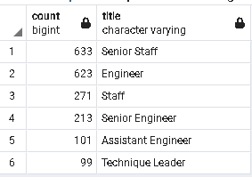

# Pewlett-Hackard-Analysis

1. Overview of the analysis:

   The purpose of this analysis is to determine the number of retiring employees per title, and identify employees who are eligible to participate in a mentorship program.  The results are contained in the the tables listed below.

   - Unique Titles table that has the number of retirement-age employees by most recent job title
   - Mentorship-eligibility table that holds the current employees who were born between January 1, 1965 and December 31, 1965

2. Results:

   - Senior Engineer, Senior Staff, Engineer all have 10,000 to 30,000 employees that are retirement age.
   - Technique Leader, Assistant Engineer have 1,000 to 5,000 employees that are retirement age.

   * There are 1,940 current employees that are eligible to participate in the mentorship program.
   * ss

   

3. Summary:

   - The number of retirement age employees is significantly high in several key roles as shown above in the results.

   - There are a lot of employees eligible to participate in the mentorship program.

     


Another query here

```sql
SELECT COUNT(title), title
INTO mentorship_count_titles
FROM mentorship_eligibilty
GROUP BY title
ORDER BY title DESC;
```

Using the query below we can see where there might be resources to help bring current employees up to fill in some of the upcoming vacancies.

```sql
SELECT COUNT(title), title
INTO mentorship_count_titles
FROM mentorship_eligibilty
GROUP BY title
ORDER BY title DESC;
```



